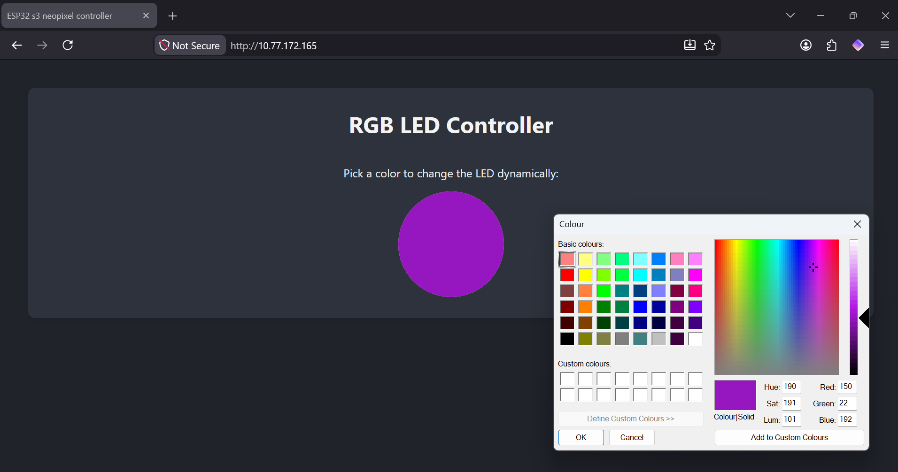
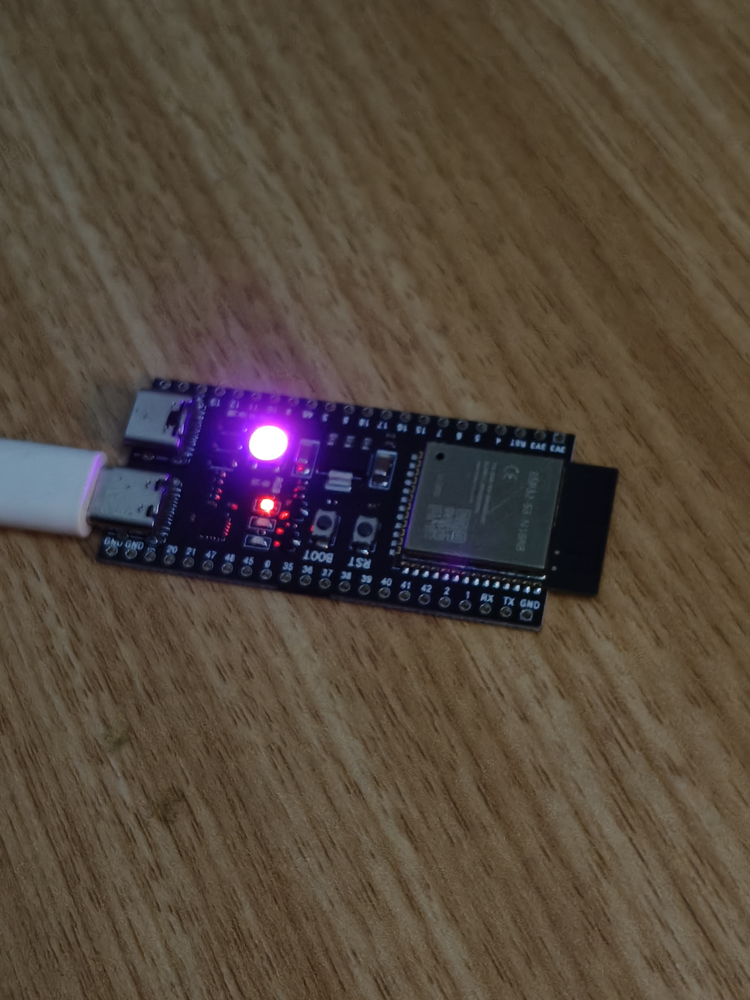

# esp32-s3-neopixel-control-server
A small demo that sets up the esp32 in station mode and hosts a server on local LAN, allowing the user to control the colour of the inbuilt neopixel. The esp32 s3 devboard has the neopixel wired to pin 48, make sure to change "const int rled = 48" to whatever pin your neopixel is connected to. Alternatively, the rgb values can be fed as pwm signals to 3 separate pins to drive an external rgb.

## How the webpage served looks

<h1>An image of the esp32 s3's neopixel displaying the selected colour</h1>

